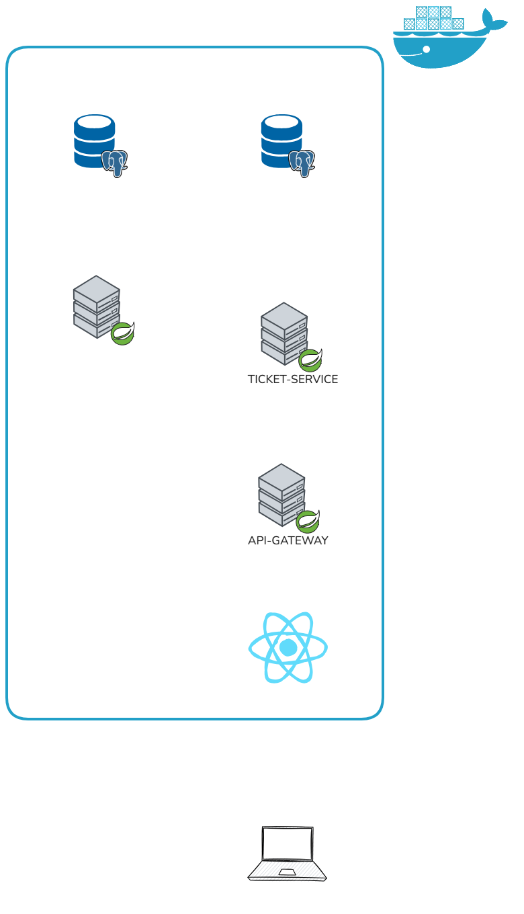
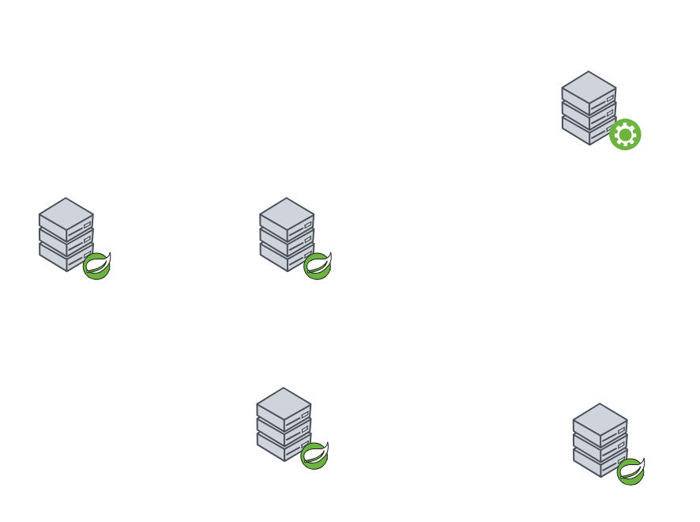

# 🎬 MyTicketApp

A modern cinema ticket booking system built with a microservices architecture using Spring Boot and React.

## 📖 Overview

MyTicketApp is a full-stack application that enables users to browse movies, view showtimes, and book cinema tickets. The system is designed with a distributed microservices architecture to ensure scalability, maintainability, and independent service deployment.

## 🏗️ Architecture

The application follows a microservices architecture pattern with the following key components:

### 🔧 Backend Services

- **API Gateway** - Entry point for all client requests, handles routing to appropriate microservices
- **Service Registry** - Eureka-based service discovery for dynamic service registration and lookup
- **Config Server** - Centralized configuration management for all microservices
- **Auth Service** - Handles user authentication, authorization, and JWT token management
- **Ticket Service** - Core business logic for managing movies, showtimes, halls, seats, and ticket bookings

### 💻 Frontend

- **React Application** - Modern, responsive single-page application for user interaction

## 🏗️ Architecture Diagrams

### Overall System Architecture



The diagram above illustrates the complete microservices architecture, showing how all components interact with each other.

### Spring Cloud Infrastructure



This diagram focuses on the Spring Cloud components (Config Server and Service Registry) and how they provide centralized configuration and service discovery for the entire system.

## ⚙️ Technology Stack

### ☕ Backend
- **Framework**: Spring Boot 4.0.2
- **Language**: Java 21
- **Build Tool**: Maven
- **Service Discovery**: Spring Cloud Netflix Eureka
- **Configuration**: Spring Cloud Config
- **API Gateway**: Spring Cloud Gateway
- **Database**: PostgreSQL (production), H2 (development/testing)
- **Security**: Spring Security with JWT
- **ORM**: Spring Data JPA
- **Mapping**: MapStruct
- **Documentation**: SpringDoc OpenAPI

### ⚛️ Frontend
- **Framework**: React 19
- **Language**: TypeScript
- **Build Tool**: Vite
- **UI Library**: HeroUI
- **Styling**: Tailwind CSS 4
- **State Management**: Zustand
- **Data Fetching**: TanStack Query (React Query)
- **Routing**: React Router 7
- **Form Handling**: React Hook Form
- **Validation**: Zod
- **Package Manager**: pnpm

### 🚀 DevOps
- **Containerization**: Docker
- **Orchestration**: Docker Compose
- **Health Checks**: Spring Boot Actuator

## ✨ Core Features

### 🎥 Movie Management
- Browse available movies with posters and details
- View movie duration and other metadata

### 🕐 Showtime Management
- View scheduled movie showtimes
- Showtimes are associated with specific halls and movies

### 🪑 Hall & Seat Management
- Multiple cinema halls with configurable seating arrangements
- Real-time seat availability tracking

### 🎟️ Ticket Booking
- Book tickets for specific showtimes and seats
- Ticket status tracking (RESERVED, EXPIRED, CANCELLED)
- Prevention of double-booking through database constraints

### 🔐 User Authentication
- Secure user registration and login
- JWT-based authentication
- Token revocation support
- Role-based authorization

## 🔄 Service Communication

- **Service Discovery**: Services register with Eureka for dynamic discovery
- **Configuration Management**: Services fetch configuration from Config Server
- **API Gateway**: All external requests route through the gateway for security and load balancing
- **Inter-service Communication**: REST APIs with proper authentication propagation

## 🗄️ Database Schema

The ticket service manages the following core entities:
- **Movie**: Movie information (name, duration, poster)
- **Hall**: Cinema halls with seating capacity
- **Seat**: Individual seats within halls
- **Showtime**: Movie screening schedules
- **Ticket**: Booking records linking users, seats, and showtimes

The auth service manages:
- **User**: User accounts with credentials and roles
- **Revoked Tokens**: Token blacklist for logout functionality

## 📋 Prerequisites

- Java 21 or higher
- Maven 3.6+
- Docker and Docker Compose
- Node.js 18+ (for frontend development)
- pnpm (for frontend package management)
- PostgreSQL (for production deployment)

## 🚀 Running the Application

### 🐳 Using Docker Compose

The easiest way to run the entire application stack:

```bash
docker-compose up
```

This will start all services with proper health checks and dependencies.

### 🔌 Service Ports

- **Service Registry (Eureka)**: http://localhost:8761
- **Config Server**: http://localhost:8088
- **API Gateway**: http://localhost:8060
- **Auth Service**: http://localhost:8081
- **Ticket Service**: http://localhost:8082
- **Frontend**: Configure based on Vite settings

### ⚙️ Running Services Individually

Each microservice can be run independently using Maven:

```bash
cd [service-name]
./mvnw spring-boot:run
```

### 🎨 Running the Frontend

```bash
cd Frontend
pnpm install
pnpm dev
```

## 👨‍💻 Development

### 📁 Project Structure

The project follows a multi-module Maven structure with separate directories for each microservice and the React frontend.

### ⚙️ Configuration Profiles

Multiple Spring profiles are available:
- `default`: Local development with H2 database
- `h2`: H2 in-memory database
- `docker`: Docker environment with PostgreSQL
- `dev`: Development-specific configurations

### ✅ Code Quality

- MapStruct for type-safe object mapping
- Lombok for boilerplate reduction
- Spring Boot Actuator for monitoring and health checks
- Comprehensive exception handling with global error handlers

## 🔒 Security

- JWT-based stateless authentication
- Token revocation for secure logout
- Password encryption using Spring Security
- Role-based access control
- Request filtering at API Gateway level

## 🤝 Contributing

This is a personal project for learning and demonstration purposes.

## 📄 License

This project is private and not licensed for public use.
